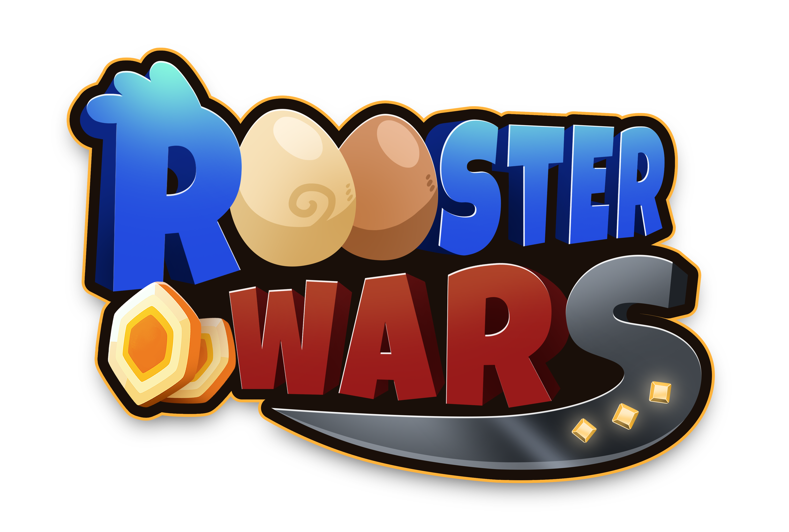

# **Introduction**

<!-- Logo Banner -->

## **OVERVIEW**

Rooster Wars is a PvP online multiplayer game where players can collect, and PLAY TO EARN, by fighting with their roosters in the arena and finishing levels in adventure mode. More features will also become available like breeding, expeditions, and land expansion.

Development is divided into the following phases:

1. Combat Phase and initial Play to Earn Features
2. Breeding and Farm Management
3. Land and Buildable Structures

## **LORE**

Since the dawn of time we Mannochs have been living together peacefully in one giant island here in the Planet Galleos. Until one day, a large and mysterious meteor plunged into the center of our land and separated it into smaller landmasses. Because of that, we were all divided into separate tribes. Little did we know that the meteor held the key to our future.
