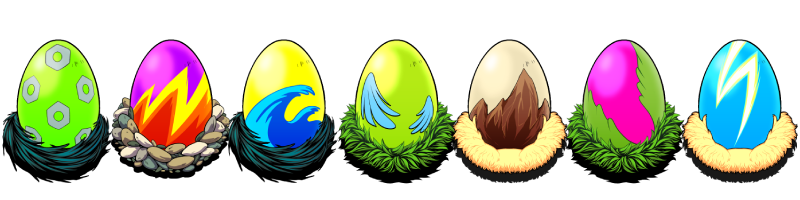
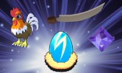

# Egg Sale (NFTs)

<!-- Egg Banner -->

Rooster Wars will have its first-ever NFT sale on December XX, 2021. There will only be a total of **150,000 Eggs** to be sold at a very attractive price of **$30** each!

Not only will you get your very own Rooster, but the Eggs also contain Gems and GAFFs (blades) to be equipped by your Roosters. That’s right you will get 3 NFTs for only $30 once you participate in our first, and only, Egg-Sale!

Available until Supplies Last!

### Egg Limit/Wallet

To allow other users to play, we would place a limit of 10 Eggs per wallet during the Egg-Sale

### Benefits

<!-- Single Egg -->

Participating in the Egg-Sale will allow users to have a pure breed NFT Rooster, a Gem, and a GAFF to be equipped to upgrade Roosters' stats.

Having Gen-0 Roosters from the eggs will allow players to play the game in its first season and gain an advantage in PvP rankings by playing more games to get higher ranks, thus higher rewards.

The supply of Roosters will initially be limited to the Egg-Sale. The additional supply of Roosters would come from breeding upon release.
