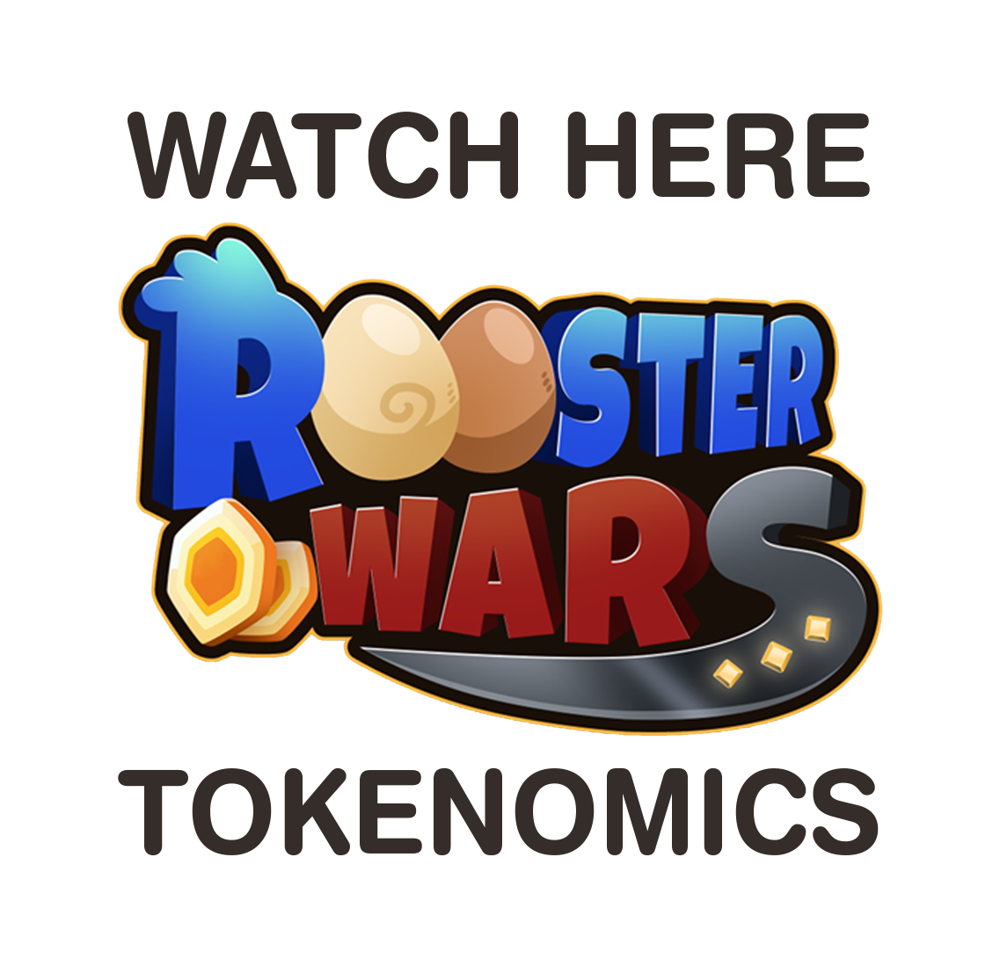

# **THE GALLO.D SECURITY TOKEN**

GALLO.D is a Registered Digital Asset (RDA) officially filed as a security in the US under the Securities Act of 1933 under CIK number 0001954925 with File number <a href="https://www.sec.gov/Archives/edgar/data/1954925/000195492523000019/xslFormDX01/primary_doc.xml">021-466244</a> (The CIK number is verifiable under the USSEC.GOV/EDGAR; Electronic Data Gathering Analysis and Retrieval). This investment is in form of a debenture that carries a guaranteed yield of 8% per annum. This interest credit will be awarded every first day of the month as a price adjustment. 

The repository of GALLO.D is a hot wallet within PECADO under the custody of Fowl Play, Inc. GALLO.D is convertible to the QBUX utility token of Rooster Wars on a one-to-one conversion. It can also be converted in part or in whole to GALLO (preferred shares of Fowl Play, Inc.) based on the prevailing market price on the day of conversion.

## **THE “TOKENOMICS” OF THE GALLO.D SECURITY TOKEN**

## **GALLO.D is a tradable digital asset to PECADO’s stable currency, USD.D.**
