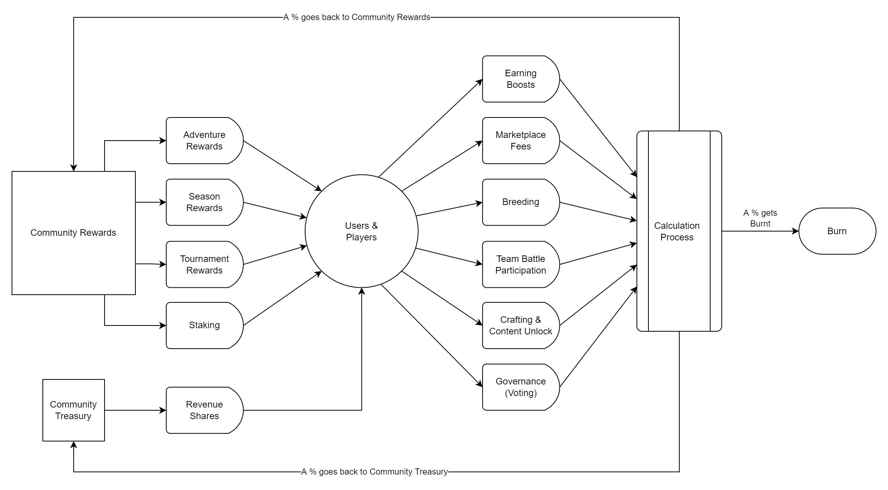

# **$GWIT Tokenomics**

**Important Notice**: _To the Rooster Wars' Community, the Tokenomics is currently under going consultations for a better and more sustainable ecosystem. Details will be posted soon._

_The following sections are also undergoing changes caused by changes in the tokenomics:_

- [Game Mode Rewards](../gameplay/game-rewards/index.md)
- [DeFi Ecosystem](../defi/index.md)

_Thank you for your support!_

## **Current Available Information**

This section contains Current Available Information regarding $GWIT Tokenomics

- **Circular Economy**
- **Utility**
- **Allocation** (TBA)
- **Vesting Schedules** (TBA)
- **$GWIT Sale Rounds** (TBA)

Always **DYOR**!

## **Circular Economy**

$GWIT token is built on a circular economic model with a limited token supply.

The reward pools (Gaming and Farming) will be filled up using the subscription method of the gameplay that allows $GWIT to circulate in a healthy manner. Fees from Marketplace transactions will also play a role in filling up the reward pools.

Also a sell tax is part of the GWIT smart contract that takes a percentage (%) of selling volume that goes to reward pools.

## **Utility**

The $GWIT token functions as the main utility token for the Rooster Wars game and ecosystem.

Here are examples of the $GWIT token's utilities in the Rooster Wars ecosystem

1.  Breeding: Payment for breeding fees _(future)_
2.  Land Acquisition _(future)_
3.  NFT Marketplace: Buy & Sell Roosters, Hens, GAFFs, Gems, and more.
4.  Buying Gilly Juice
5.  Farming / Staking: Earn Rewards
6.  Participate in other Game Modes: Earn Rewards
7.  PVP Mode by:
    1. Winning $Gallonium from PVP
    2. Swapping $Gallonium to $GWIT
    3. Trading $GWIT to other cryptocurrency
    4. Getting Season Rewards

**Additional utilities will be added with the continuous development of Rooster Wars and integration with other protocols.**

<!-- TOKENOMICS REVAMP: May 3,2022

## **Allocation**

$GWIT Total Supply is 1,000,000,000 (1 Billion Tokens). Allocation is shown in the table below

|               |     **Tokens**    |  **Share**  |
|---------------|:-----------------:|:-----------:|
| Pre-Seed      |     40,000,000    |    4.00%    |
| Seed Round    |     80,000,000    |    8.00%    |
| Strategic     |     50,000,000    |    5.00%    |
| Pre-Public    |     10,000,000    |    1.00%    |
| Marketing     |     50,000,000    |    5.00%    |
| Team          |    130,000,000    |    13.00%   |
| Advisors      |     20,000,000    |    2.00%    |
| Airdrop       |     20,000,000    |    2.00%    |
| Farming       |    100,000,000    |    10.00%   |
| Game Rewards  |    400,000,000    |    40.00%   |
| Treasury      |     70,000,000    |    7.00%    |
| Dex Liquidity |     30,000,000    |    3.00%    |
|   **Total**   | **1,000,000,000** | **100.00%** |

Below is a chart of the Tokenomics or Token Allocation of $GWIT token.

## **Token Sale Rounds**

_“We aim to achieve a somewhat fair launch while trying to raise initial funding. Hence we narrowed down the price differences in each round.”_

### **Private Sale**

All Private Sale tokens will be transferred into a public wallet address upon contract deployment. The investors will be given 6% of the total supply of $GWIT tokens amounting to 60,000,000 $GWIT.

Vesting Schedule: 15% unlocked at TGE + Monthly vesting for 12 months

**How to Participate?**

- Minimum Investment: TBA

### **Presale 1**

10% of "Presale 1" tokens will be unlocked at TGE while the remaining 90% will be placed in a public wallet address and will be distributed to token owners in accordance with its vesting schedule: 10% TGE then Monthly for 6 months

The "Presale 1" amounts to 9% of the total supply of $GWIT tokens which is 90,000,000 $GWIT.

**How to Participate?**

- Minimum Investment: TBA
- Maximum Investment: TBA

### **Presale 2** (No Vesting Period)

"Presale 2" amounts to 1% of the total supply of $GWIT, which is 10,000,000 $GWIT, and will be unlocked on TGE.

**How to Participate?**

- Minimum Investment: None
- Maximum Investment: TBA
- Whitelisted Addresses

### **Initial DEX Offering (IDO)**

Starting price: TBA

## **Vesting Schedule**

Below is a table overview of the different vesting schedules based on $GWIT allocation.

| **Allocations** |     **Tokens**    |  **Share**  | **TGE Release** | **Cliff (Months)** | **Vesting** | **Period (Months)** |
|:---------------:|:-----------------:|:-----------:|:---------------:|:------------------:|:-----------:|:-------------------:|
| Pre-Seed        |     40,000,000    |     4.0%    |       3.0%      |         12         |    Linear   |          24         |
| Seed Round      |     80,000,000    |     8.0%    |       3.0%      |         12         |    Linear   |          24         |
| Strategic       |     50,000,000    |     5.0%    |       5.0%      |         12         |    Linear   |          18         |
| Pre-Public      |     10,000,000    |     1.0%    |      20.0%      |                    |    Linear   |          2          |
| Marketing       |     50,000,000    |     5.0%    |       5.0%      |          1         |    Linear   |          35         |
| Team            |    130,000,000    |    13.0%    |       0.0%      |         12         |    Linear   |          24         |
| Advisors        |     20,000,000    |     2.0%    |       0.0%      |         12         |    Linear   |          24         |
| Airdrop         |     20,000,000    |     2.0%    |       0.0%      |          1         |    Linear   |          4          |
| Farming         |    100,000,000    |    10.0%    |       0.0%      |                    |    Daily*   |                     |
| Game Rewards    |    400,000,000    |    40.0%    |      35.0%      |          1         |    Linear   |          20         |
| Treasury        |     70,000,000    |     7.0%    |       0.0%      |          6         |     None    |                     |
| Dex Liquidity   |     30,000,000    |     3.0%    |      100.0%     |                    |     None    |                     |
|    **Total**    | **1,000,000,000** | **100.00%** |                 |                    |             |                     |

_\*Farming Token release starts from 0.18% of Farming tokens on Day 1 then applies 0.005% deflator each day forward._

_Airdrop tokens may be used for future airdrop activities_

-->