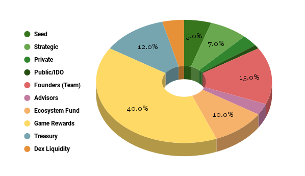

# **THE GALLO SECURITY TOKEN**

The GALLO is a Security Token that represents a fractional interest in the preferred shares of Fowl Play Inc., Rooster Wars’ proprietor. Using the US SEC’s Securities Act of 1933 framework, through a DAO (Decentralized Autonomous Organization) issuance, the GALLO Security Token is a registered security with Central Index Key # 0001954925 verifiable in the US SEC’s EDGAR (Electronic Data Gathering, Analysis, and Retrieval). This GALLO Security Token will be used to stake into the ANTx system for an NFT player to be given the QBUX (derivative utility token within ANTx) equivalent which can then be utilized for game staking.

With the current valuation of Fowl Play Inc., a total of 20 million Security Tokens have been released initially valued at $0.50. This amounts to $10,000,000.00 of issuance representing 10% of the valuation. This will be the total outstanding preferred shares to be issued to the public, including NFT collectors.

## **THE “TOKENOMICS” OF THE GALLO SECURITY TOKEN**

The valuation of the GALLO Security Token is hedge on the enterprise value of Fowl Play Inc., since it represents the Preferred Shares of the firm. With Fowl Play Inc. bolted into a publicly listed investment holdings company as one of its assets via an equity swap arrangement, this establishes a floor price on the digital security. Fowl Play Inc. as an enterprise has a huge upside on its valuation considering the novelty of the game offering and the blockchain infrastructure behind it. Through its international affiliate Ashtree Block Ventures (USA, EU, Australia, and SEA) <a href="https://www.ashtreebv.com"> www.ashtreebv.com</a>, the blockchain backbone of Fowl Play Inc. both on the legal framework and technology, are leading edge.

## **CURRENT VALUATION**

(Pre-Launching - assuming only a maximum of 600,000 active users which is conservative)

## **The GALLO Security Token Has 3 Major Attributes:**

1. As a security investment instrument pegged on the preferred shares of Fowl Play Inc.
2. As a utility token to buy into the Staking Pool
3. Intrinsic value derived from being an asset of a publicly traded entity, from being a traded digital asset in select digital exchanges, and peer to peer demand from the Rooster Wars’ gaming community itself.
